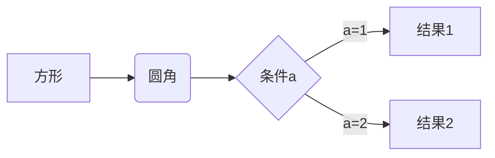
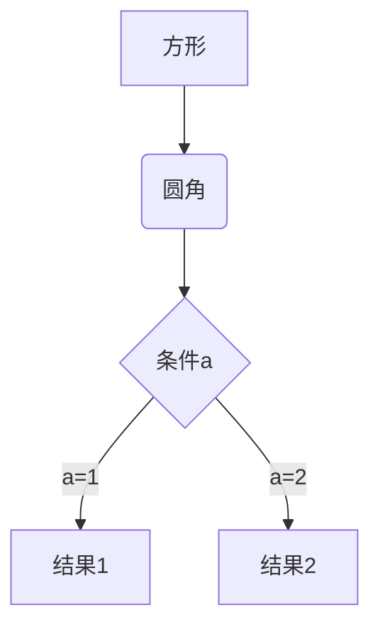
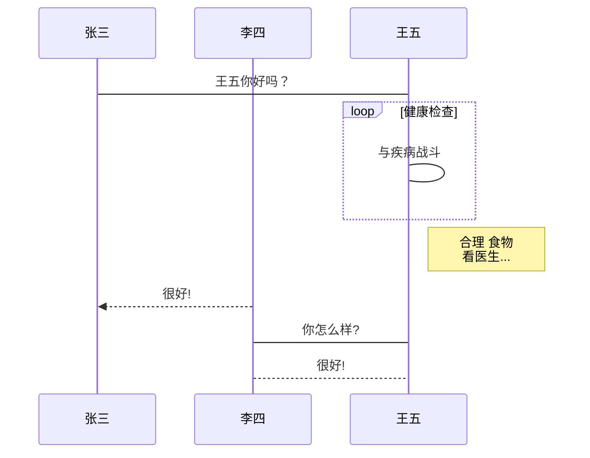
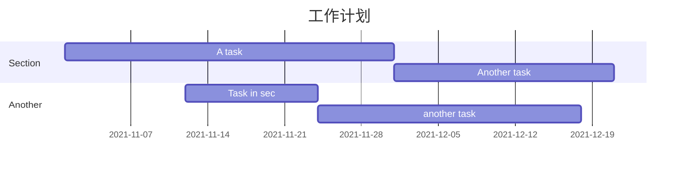
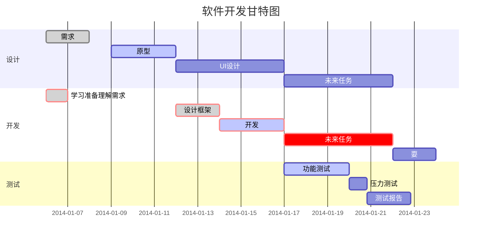

# *Markdown* 教程

## *md* 编辑器

软体：

- *VSCode：https://code.visualstudio.com/*

- *Typora：https://typoraio.cn/*
- *Obsidian：https://obsidian.md/*

## 目录

输入 `[TOC]`，然后按下回车键。

如下：

[TOC]

> 这个目录在 *Obsidian* 中无法实现，*Obsidian* 需要依赖插件去实现

## 标题

```pseudocode
# 一级标题
## 二级标题
### 三级标题
#### 四级标题
##### 五级标题
###### 六级标题

/*快捷键*/
一级标题:	Ctrl + 1
二级标题:	Ctrl + 2
三级标题:	Ctrl + 3
四级标题:	Ctrl + 4
五级标题:	Ctrl + 5
六级标题:	Ctrl + 6

快捷键: 只在Typora中有效，在Obsidian中需要自定义快捷键
```

### 一级标题

- 输入一串文本，然后按下 `Shift` + `Enter` ，然后输入两个以上的 `==`，然后再按 `Enter` 键
- 使用一个 `# 文本` ，然后按 `Enter` 键

### 二级标题

- 输入一串文本，然后按下 `Shift` + `Enter` ，然后输入两个以上的 `--`，然后再按 `Enter` 键
- 使用一个 `## 文本` ，然后按 `Enter` 键

> **注意**：在 *Typora* 中， `Enter` 键是换两行，`Shift` + `Enter` 快捷键才是换一行

## 字体

### 粗体

- `**粗体**`
  - **粗体**

- `__粗体__`
  - __粗体__
- 使用 *H5* `<b>` 标签：`<b>粗体</b>`
  - <b>粗体</b>
- 快捷键：`Ctrl` + `B`

### 斜体

- `*斜体*`
  - *斜体*
- `_斜体_`
  - _斜体_
- 使用 *H5* `<i>` 标签：`<i>斜体</i>`
  - <i>斜体</i>

- 快捷键：`Ctrl` + `i`

### 粗斜体

- `***粗斜体***`
  - ***粗斜体***
- `___粗斜体___`
  - ___粗斜体___

### 删除线

- `~~删除~~`
  - ~~baidu~~

### 下划线

- 使用 `<u>` 标签实现：`<u>下划线</u>`
  - <u>下划线</u>

### 高亮

- `==高亮==`
  -  ==高亮==

> 高亮的语法需要在 Typora 中的 **" 文件 " --- " 偏好设置 " --- " *Markdown* " 中勾选 " 高亮 "**

### 上下标

- 上标：`^上标^`、`<sup>上标</sup>`
  - x^2^
- 下标：`~下标~`、`<sub>下标</sub>`
  - h~2~O

### ~~遮挡~~

> **这个语法在 *Typora* 中无法使用**

~~如果你恰好有 *discord* 或 *telegram* ，在文本框中输入 `||文本||`~~

### 字体样式

#### 居中、左 / 右对齐

> 使用 `<p>` 标签中的 `align` 属性

- 左对齐

  <p algin="left">文本左对齐</p>

- 居中

  <p align="center">文本居中</p>

- 右对齐

  <p align="right">文本右对齐</p>

#### 字体颜色

> 使用 `<font>` 或者 `<span>` 标签

- 字体颜色

  ```html
  <font color="#FF0000">红色</font>
  ```

  <font color="#FF0000">红色</font>

- 背景色

  ```html
  <span style="background:#ca6924;">sfaf</span>
  ```

  <span style="background:#ca6924;">sfaf</span>

## 段落

在 *markdown* 中使用一个空行表示一个新的段落

即 使用 `Enter` 产生一个新的段落，使用 `Shift` + `Enter` 同一段落的文本换行

### 分割线

> 在行中输入 3 个以上的星号 ( `*` ) 或 减号 ( `-` ) 然后按 `Enter` 键来建立分割线

- `***`

  ***

- `*****`

  *****

- `---`

  ---

- `-----`

  -----

- `----------`

  ----------

### 脚注

格式：`[^脚注的文本]`

- 创建脚注：

  ```pseudocode
  书的作者是 **张三**[^1]
  [^1]:张三, 浙江绍兴人
  ```

- 效果：

  书的作者是 **张三**[^1]

  [^1]: 张三, 浙江绍兴人

## 列表

- 有序列表：使用 数字 + `.` + 空格

  ```pseudocode
  1. AAA
  2. BBB
  3. CCC
  ```

  1. AAA
  2. BBB
  3. CCC

- 无序列表

  > 三种符号，推荐使用短横杠 ( `-` )

  - `*` + 空格

  - `+` + 空格
  - `-` + 空格

  ```pseudocode
  * AAA
  + BBB
  - CCC
  ```

### 列表嵌套

> 列表的嵌套只需体现在空格上，子列表的元素在前面有 *4* 个缩进即可

```
1. 第一项
    - 第一个元素
    - 第二个元素
2. 第二项
    - 第一个元素
    - 第二个元素
```

- 使用一个 `Enter` 键就是列表递进，两个 `Enter` 键就是取消
- 使用 `Tab` 键使列表缩进
- 使用 `Shift` + `Tab` 就是取消缩进

> 冷知识：在列表中使用 `Ctrl` + `Enter`  = `Enter` + `Tab` + `Enter`

### 复选框

- 选中：`-` + 空格 + `[x]` + 空格
  - [x] 选中
- 未选中：`-` + 空格 + `[ ]` + 空格
  - [ ] 未选中

## 区块

- `>` + 空格

  > 这是一个区块

### 区块嵌套

- 一个 `>` 符号是最外层，两个 `>` 符号是第一层嵌套

  ```pseudocode
  > 最外层
  > 
  > > 第一层嵌套
  > >
  > > > 第三层
  > > >
  > > > > 以此类推
  ```

  > 最外层
  >
  > > 第一层嵌套
  > >
  > > > 第三层
  > > >
  > > > > 以此类推

### 区块与列表嵌套

**区块中使用列表**

```pseudocode
- 第一项
    > 第一个元素
    > 第二个元素
- 第二项
	> 第一个元素
	> 第二个元素
```

- 第一项
    > 第一个元素
    > 第二个元素
- 第二项
	> 第一个元素
	> 第二个元素

**列表中使用区块**

```pseudocode
> 列表
> 1. 第一项
> 2. 第二项
> - 第一项
> - 第二项
```

> 列表
> 1. 第一项
> 2. 第二项
> - 第一项
> - 第二项

## 代码

- 使用反引号 <code>`</code> 
  - `printf()`
- 使用 H5 标签 `<code>`
  - <code>printf()</code>

### 代码块

- 使用一对三个反引号包裹代码内容：<code>```</code> + 语言

  ~~~pseudocode
  ```javascript
  $(document).ready(function(){
  	alert("hello");
  });
  ```
  ~~~

  ```javascript
  $(document).ready(function(){
  	alert("hello");
  });
  ```

- 使用快捷键：`Ctrl` + `Shift` + `K`

## 超链接

- `[链接名](链接地址)`
  - [百度一下 , 你就知道](https://www.baidu.com/)
- `<链接地址>`
  - <https://www.baidu.com/>

### 高级链接

可以设置通过设置一个变量，变量复制在文档底部 ( 类似于脚注 )

```pseudocode
这是 [baidu][a] 的地址 
这是 [Bilibili][b] 的网址 

[a]: https://www.baidu.com/
[b]: https://www.bilibili.com/
```

这是 [baidu][a] 的地址
这是 [Bilibili][b] 的网址 

[a]: https://www.baidu.com/
[b]: https://www.bilibili.com/

> 这里我们赋了一个变量 *a* 值为百度网址，变量 *b* 值为 *bilibili* 的网址，这些变量可以像脚注一样标注在文档的底部

## 图片

> - 图片以 `!` 开头
>
> - `[]` 中存放图片的代替文本
> - `()` 中存放图片的地址，最后可以选择加上 `title` 属性值

- ``

  ```pseudocode
  
  ```

  

- `[alt 文本](图片地址 "标题")`

  ```pseudocode
  
  ```

  

  >**注意**：图片可以像链接一样使用变量
  >
  >如：
  >
  >```pseudocode
  >这是 Typora [Typora][t]
  >[t]: https://typoraio.cn/img/favicon-64.png
  >```
  >
  >这是 Typora ![Typora][t]
  >
  >[t]: https://typoraio.cn/img/favicon-64.png

- 使用 `` 标签：以上的方式不能自定义图片的大小以及位置

  ```html
  
  ```

  


## 表格

- 使用 `|` 分隔单元格，使用 `-` 分隔表头

  ```pseudocode
  | 表头 | 表头 |
  | --- | --- |
  | 单元格| 单元格 |
  | 单元格| 单元格 |
  ```

  | 表头   | 表头   |
  | ------ | ------ |
  | 单元格 | 单元格 |
  | 单元格 | 单元格 |

- 使用快捷键 ：`Ctrl` + `T`

### 表格对齐

- `-:`：右对齐
- `-:`：左对齐
- `:-:`：居中对齐

```pseudocode
| 左对齐 | 居中对齐 | 右对齐 |
| :---- | :----: | ----:|
| 单元格 | 单元格 | 单元格 |
| 单元格 | 单元格 | 单元格 |
```

| 左对齐 | 居中对齐 | 右对齐 |
| :----- | :------: | -----: |
| 单元格 |  单元格  | 单元格 |
| 单元格 |  单元格  | 单元格 |

## 数学

> *markdown* 中使用 *[KaTex](https://github.com/Khan/KaTeX)* 或 *[MathJax](https://github.com/mathjax/MathJax)* 渲染数学公式

- 公式。写在一对 `$` 中

  $y=kx+b$

- 公式块。写在一对 `$$` 中 ( 居中显示 )
  $$
  y=kx+b
  $$

> 公式块的快捷键：`Ctrl` + `Shift` + `M` 
>
> $$\begin{CD}
>    A @>a>> B \\
> @VbVV @AAcA \\
>    C @= D
> \end{CD}$$

### 上下标

|      | 符号 | 效果     | 语法     |
| ---- | ---- | -------- | -------- |
| 上标 | `^`  | $x^2$    | `x^2`    |
| 下标 | `_`  | $log_2x$ | `log_2x` |

> **注意**：如果 上标 或 下标 大于 *1* 个字符，需要使用 `{}` 括起来

### 分式

|        | 效果           | 语法           |
| ------ | -------------- | -------------- |
| 分式   | $\frac{x}{y}$  | `\frac{x}{y}`  |
|        | $x\over y$     | `x\over y`     |
| 二项式 | $\binom{n}{k}$ | `\binom{n}{k}` |

### 开方

- `\sqrt[n]{a}`：`a` 为被开方数，`n` 为根指数 ( 省略 `n` 就是二次根式 )

  $\sqrt{4}$

  $\sqrt[3]{9}$

### 常用括号

| 括号                  | 语法                  |
| --------------------- | --------------------- |
| $(x+y)$               | `(x+y)`               |
| $[x+y]$               | `[x+y]`               |
| $\{x+y\}$             | `\{x+y\}`             |
| $\langle x+y \rangle$ | `\langle x+y \rangle` |
| $|x+y|$               | `|x+y|`               |
| $\|x+y\|$             | `\|x+y\|`             |

例：

​	$f(x,y)=x^2+y^2,x\epsilon[0,100],y\epsilon\{1,2,3\}$

#### 括号放大或缩小

```pseudocode
括号级别:
\big:  小括号
\Big:  中括号
\bigg: 大括号
\Bigg: 超大括号
```

| 括号                                             | 语法                                             |
| ------------------------------------------------ | ------------------------------------------------ |
| $\big(\Big(\bigg(\Bigg($                         | `\big(\Big(\bigg(\Bigg(`                         |
| $\big[\Big[\bigg[\Bigg[$                         | `\big[\Big[\bigg[\Bigg[`                         |
| $\big\{\Big\{\bigg\{\Bigg\{$                     | `\big\{\Big\{\bigg\{\Bigg\{`                     |
| $\big\langle\Big\langle\bigg\langle\Bigg\langle$ | `\big\langle\Big\langle\bigg\langle\Bigg\langle` |
| $\big\rangle\Big\rangle\bigg\rangle\Bigg\rangle$ | `\big\rangle\Big\rangle\bigg\rangle\Bigg\rangle` |
| $\big|\Big|\bigg|\Bigg|$                         | `\big|\Big|\bigg|\Bigg|`                         |
| $\big\|\Big\|\bigg\|\Bigg\|$                     | `\big\|\Big\|\bigg\|\Bigg\|`                     |
| $\big\lceil\Big\lceil\bigg\lceil\Bigg\lceil$     | `\big\lceil\Big\lceil\bigg\lceil\Bigg\lceil`     |
| $\big\rceil\Big\rceil\bigg\rceil\Bigg\rceil$     | `\big\rceil\Big\rceil\bigg\rceil\Bigg\rceil`     |
| $\big\lfloor\Big\lfloor\bigg\lfloor\Bigg\lfloor$ | `\big\lfloor\Big\lfloor\bigg\lfloor\Bigg\lfloor` |
| $\big\rfloor\Big\rfloor\bigg\rfloor\Bigg\rfloor$ | `\big\rfloor\Big\rfloor\bigg\rfloor\Bigg\rfloor` |

例：

​	$(\sqrt{1 \over 2})$

​	$\left(\sqrt{1 \over 2}\right)$

​	$\bigg(\sqrt{1 \over 2}\bigg)$

> 由此可见 
>
> - `\left(\right)` 括号的大小等同于 `\bigg(\bigg)`
> - 但是，`\left(\right)` 必须成对出现

$y :\begin{cases} x+y=1\\ x-y = 0 \end{cases}$

### 向量

- `\vec{a}`

  $\vec{a}$

例：

$\vec a\cdot\vec b=1$

### 积分

- `\int`

  $\int_0^1x^2dx$

### 极限

- `\lim_{n\rightarrow+\infty}`

  $\lim_{n\rightarrow+\infty}f(x)$

- `\lim_{x\to\infty}`

  $\lim_{x\to\infty}f(x)$

$$
\lim_{x\to\infty} f(x)
$$

### 累加 / 累乘

- 累加：`\sum_{}`

  $\sum_{n=1}^{100} n$

- 累乘：`\prod_{i=0}^n`

  $\prod_{i=0}^n$

### 方程格式

#### 长公式

- 开头 `\begin{multline*}` 

- `\\` 换行

- 结尾 `end{multline*}`
  $$
  \begin{multline*}
  f(x)=3x^6+2x^2y^3+6x^4y^2+5x^2y^4+5x^2y^4+5x^2y^4+5x^2y^4+5x^2y^4+5x^2y^4+5x^2y^4+5x^2y^4+5x^2y^4\\
  +3x^6+2x^2y^3+6x^4y^2+5x^2y^4-12x^2+3x^6+2x^2y^3+6x^4y^2+5x^2y^4-12x^2
  \end{multline*}
  $$


#### 拆分后对齐

- 开头 `\begin{align*}`
- `\\ `换行
- 等号左边加上 `&`
- 结尾 `\end{align*}`

$$
\begin{align*}
x&=y				&	x &= z				&	a&=b+c\\
2x&=-y				&	3x&=\frac{1}{2}y	&	a&=b\\
5x&=2y+4			&	2x&=3				&	xy&=1
\end{align*}
$$

#### 居中显示

- 开头 `\begin{gather*}`
- `\\` 换行
- 结尾 `\end{gather*}`

$$
\begin{gather*}
2x-5y=8\\
3x^2+2y=1
\end{gather*}
$$

#### 公式中的空格 ( 间距 )

|                   | 效果         | 语法         | 描述                             |
| ----------------- | ------------ | ------------ | -------------------------------- |
| 两个 `\quad` 空格 | `a \qquad b` | $a \qquad b$ | 两个 $m$ 的宽度                  |
| 一个 `\quad` 空格 | `a \quad b`  | $a \quad b$  | 一个 $m$ 的宽度                  |
| 空格              | `a\ b`       | $a\ b$       | $\frac{1}{3}$ 个 $m$ 的宽度      |
| 中空格            | `a\;b`       | $a\;b$       | $\frac{2}{7}$ 个 $m$ 的宽度      |
| 小空格            | `a\,b`       | $a\,b$       | $\frac{1}{6}$ 个 $m$ 的宽度      |
| 无空格            | `ab`         | $ab$         |                                  |
| 紧贴              | `a\!b`       | $a\!b$       | 缩小 $\frac{1}{6}$ 个 $m$ 的宽度 |

### 矩阵

- $Plain$
  $$
  \begin{matrix}
  1 & 2 & 3\\
  a & b & c
  \end{matrix}
  $$

- $Parentheses;round\ brackets$
  $$
  \begin{pmatrix}
  1  &  2  &  3\\
  a  &  b  &  c
  \end{pmatrix}
  $$

- $Brackets;square\ brackets$
  $$
  \begin{bmatrix}
  1  &  2  &  3\\
  a  &  b  &  c
  \end{bmatrix}
  $$
  
- $Braces;curly\ brackets$
  $$
  \begin{Bmatrix}
  1  &  2  &  3\\
  a  &  b  &  c
  \end{Bmatrix}
  $$
  
- $Pipes$
  $$
  \begin{vmatrix}
  1  &  2  &  3\\
  a  &  b  &  c
  \end{vmatrix}
  $$
  
  
  
- $Double\ pipes$
  $$
  \begin{Vmatrix}
  1  &  2  &  3\\
  a  &  b  &  c
  \end{Vmatrix}
  $$
  

### 符号

#### 省略号

| 省略号   | 语法     | 描述             |
| -------- | -------- | ---------------- |
| $\ldots$ | `\ldots` | 底线对齐的省略号 |
| $\cdots$ | `\cdots` | 中线对齐的省略号 |
| $\cdot$  | `\cdot`  | 点乘号           |

例：

$f(x_1,x_2,\ldots,x_n)=\bigg({1 \over x_1}\bigg)^2+\bigg({1 \over x_2}\bigg)^2+\bigg({1 \over x_3}\bigg)^2+\cdots+\bigg({1 \over x_n}\bigg)^2$

#### 运算符

| 效果                    | 语法                    | 描述     |
| ----------------------- | ----------------------- | -------- |
| $\not=$                 | `\not=`                 | 不等于   |
| $\approx$               | `\approx`               | 约等于   |
| $\leq$                  | `\leq`                  | 小于等于 |
| $\geq$                  | `\geq`                  | 大于等于 |
| $\times$                | `\times`                | 乘号     |
| $\pm$                   | `\pm`                   | 正负号   |
| $\div$                  | `\div`                  | 除号     |
| $\sum$                  | `\sum`                  | 累加     |
| $\prod$                 | `\prod`                 | 累乘     |
| $\coprod$               | `\coprod`               | 累除     |
| $\overline{a+\ldots+n}$ | `\overline{a+\ldots+n}` | 平均值   |

#### 三角函数

| 效果      | 语法      | 描述                      |
| --------- | --------- | ------------------------- |
| $\bot$    | `\bot`    | 垂直                      |
| $\angle$  | `\angle`  | 角                        |
| $n^\circ$ | `n^\circ` | 几度角。如：( $30^\circ$) |
| $\sin$    | `\sin`    | 正弦                      |
| $\cos$    | `\cos`    | 余弦                      |
| $\tan$    | `\tan`    | 正切                      |
| $\cot$    | `\cot`    | 余切                      |
| $\sec$    | `\sec`    | 正割                      |
| $\csc$    | `\csc`    | 余割                      |

#### 定积分

| 效果      | 语法      | 描述     |
| --------- | --------- | -------- |
| $\infty$  | `\infty`  | 无穷     |
| $\int$    | `\int`    | 定积分   |
| $\iint$   | `\iint`   | 双重积分 |
| $\iiint$  | `\iiint`  | 三重积分 |
| $\oint$   | `\oint`   | 曲线积分 |
| $y\prime$ | `y\prime` | 求导     |
| $\lim$    | `\lim`    | 极限     |

#### 集合

| 效果        | 语法        | 描述   |
| ----------- | ----------- | ------ |
| $\emptyset$ | `\emptyset` | 空集   |
| $\in$       | `\in`       | 属于   |
| $\notin$    | `\notin`    | 不属于 |
| $\supset$   | `\supset`   | 真包含 |
| $\supseteq$ | `\supseteq` | 包含   |
| $\bigcap$   | `\bigcap`   | 交集   |
| $\bigcup$   | `\bigcup`   | 并集   |
| $\bigvee$   | `\bigvee`   | 或     |
| $\bigwedge$ | `\bigwedge` | 与     |

#### 对数

| 效果   | 语法   |
| ------ | ------ |
| $\log$ | `\log` |
| $\lg$  | `\lg`  |
| $\ln$  | `\ln`  |

#### 希腊字母

| 代码        | 符号        | 代码          | 符号          |
| ----------- | ----------- | ------------- | ------------- |
| `\alpha`    | $\alpha$    | `\beta`       | $\beta$       |
| `\gamma`    | $\gamma$    | `\delta`      | $\delta$      |
| `\epsilon`  | $\epsilon$  | `\varepsilon` | $\varepsilon$ |
| `\zeta`     | $\zeta$     | `\eta`        | $\eta$        |
| `\theta`    | $\theta$    | `\Theta`      | $\Theta$      |
| `\vartheta` | $\vartheta$ | `\pi`         | $\pi$         |
| `\phi`      | $\phi$      | `\psi`        | $\psi$        |
| `\Psi`      | $\Psi$      | `\omega`      | $\omega$      |
| `\Omega`    | $\Omega$    | `\rho`        | $\rho$        |
| `\sigma`    | $\sigma$    | `\xi`         | $\xi$         |
| `\mu`       | $\mu$       | `\partial`    | $\partial$    |

## 图表

> 使用前需要在 **" 文件 " --- " 偏好设置 " --- 勾选 " 图表 "** 

### 流程图

#### 横向

~~~pseudocode

~~~


#### 纵向

~~~pseudocode

~~~


### 标准流程图

#### 横向

````
```flow
st=>start: 开始框
op=>operation: 处理框
cond=>condition: 判断框(是或否?)
sub1=>subroutine: 子流程
io=>inputoutput: 输入输出框
e=>end: 结束框
st(right)->op(right)->cond
cond(yes)->io(bottom)->e
cond(no)->sub1(right)->op
```
````

```flow
st=>start: 开始框
op=>operation: 处理框
cond=>condition: 判断框(是或否?)
sub1=>subroutine: 子流程
io=>inputoutput: 输入输出框
e=>end: 结束框
st(right)->op(right)->cond
cond(yes)->io(bottom)->e
cond(no)->sub1(right)->op
```

#### 纵向

~~~pseudocode
```flow
st=>start: 开始框
op=>operation: 处理框
cond=>condition: 判断框(是或否?)
sub1=>subroutine: 子流程
io=>inputoutput: 输入输出框
e=>end: 结束框
st->op->cond
cond(yes)->io->e
cond(no)->sub1(right)->op
```
~~~

```flow
st=>start: 开始框
op=>operation: 处理框
cond=>condition: 判断框(是或否?)
sub1=>subroutine: 子流程
io=>inputoutput: 输入输出框
e=>end: 结束框
st->op->cond
cond(yes)->io->e
cond(no)->sub1(right)->op
```


### *UML* 

#### 时序图

~~~pseudocode
```sequence
对象A->对象B: 对象B你好吗?（请求）
Note right of 对象B: 对象B的描述
Note left of 对象A: 对象A的描述(提示)
对象B-->对象A: 我很好(响应)
对象A->对象B: 你真的好吗？
```
~~~

```sequence
对象A->对象B: 对象B你好吗?（请求）
Note right of 对象B: 对象B的描述
Note left of 对象A: 对象A的描述(提示)
对象B-->对象A: 我很好(响应)
对象A->对象B: 你真的好吗？
```

#### *UML* 复杂的时序图

~~~pseudocode
```sequence
Title: 标题：复杂使用
对象A->对象B: 对象B你好吗?（请求）
Note right of 对象B: 对象B的描述
Note left of 对象A: 对象A的描述(提示)
对象B-->对象A: 我很好(响应)
对象B->小三: 你好吗
小三-->>对象A: 对象B找我了
对象A->对象B: 你真的好吗？
Note over 小三,对象B: 我们是朋友
participant C
Note right of C: 没人陪我玩
```
~~~

```sequence
Title: 标题：复杂使用
对象A->对象B: 对象B你好吗?（请求）
Note right of 对象B: 对象B的描述
Note left of 对象A: 对象A的描述(提示)
对象B-->对象A: 我很好(响应)
对象B->小三: 你好吗
小三-->>对象A: 对象B找我了
对象A->对象B: 你真的好吗？
Note over 小三,对象B: 我们是朋友
participant C
Note right of C: 没人陪我玩
```

#### 样例

~~~pseudocode

~~~


### 甘特图

~~~pseudocode

~~~

~~~pseudocode

~~~


## 高级

### 转义字符

在 *md* 中，许多符号表示特定的意义，如果需要显示可以使用反斜杠 `\` 转义特殊字符

正常显示 `*` 号：\*\*转义过后的星号\*\*

```pseudocode
支持转义的符号
\	反斜线
`	反引号
*	星号
_	下划线
{}	花括号
[]	方括号
()	小括号
#	井号
+	加号
-	减号
.	英文句点
!	感叹号
```

> \`代码\`
>
> \_斜体\_

### *Unicode* 字符

| 特殊字符 | 描述     | 语法      |
| -------- | -------- | --------- |
| &copy;   | 版权     | `&copy;`  |
| &reg;    | 注册商标 | `&reg;`   |
| &trade;  | 上标     | `&trade;` |
| &nbsp;   | 空格     | `&nbsp;`  |
| &quot;   | 引号     | `&quot;`  |
| &euro;   | 欧元     | `&euro;`  |
| &yen;    | 元       | `&yen;`   |

### *html* 标签

如：`<kbd>`、`<b>`、`<i>`、`<em>`、`<sup>`、`<sub>`、`<br>`、`` 等

> 如：<kbd>Ctrl</kbd> + <kbd>Alt</kbd> + <kbd>Del</kbd>

#### 隐藏

使用 *h5* 新增的 `<details>` 标签

```html
<details open><!--直接在旁边加上open, 默认打开状态-->
    <summary>标题</summary>
    <div>内容</div>
</details>
```

<details>
    <summary>homebrew 安装</summary>
    <br>
    <div style="background: #282c34;">
        <code style="background: #282c34;color: #ccc;border: none;">
            " /bin/zsh "
            <span style="color: #7ec699;">-c "$(</span> 
            <span style="color: #f08d49;">curl </span> 
            <span style="color: #7ec699;">-fsSL https://gitee.com/cunkai/HomebrewCN/raw/master/Homebrew.sh)"</span>
        </code>
    </div>
    <br>
</details>

- `<details>` 嵌套 `<ul>` 中

  ```html
  <details>
      <summary>如何暴富?</summary>
      <ol>
          <li><span>买彩票</span></li>
          <li><span>被富婆包养</span></li>
      </ol>
  </details>
  ```

  <details>
      <summary>如何暴富?</summary>
      <ol>
          <li><span>买彩票</span></li>
          <li><span>被富婆包养</span></li>
      </ol>
  </details>

- `<ul>` 嵌套 `<details>`

  ```html
  <ul>
      <li>
          <details>
              <summary>项目1</summary>
              <p>内容</p>
          </details>
      </li>
      <li>
          <details>
              <summary>项目2</summary>
              <p>内容</p>
          </details>
      </li>
  </ul>
  ```

  <ul>
      <li>
          <details open>
              <summary>项目1</summary>
              <p>内容</p>
          </details>
      </li>
      <li>
          <details>
              <summary>项目2</summary>
              <p>内容</p>
          </details>
      </li>
  </ul>

### 主题

- 选择 **" 文件 " --- " 偏好设置 " --- " 外观 "**
  - **" [获取主题](https://theme.typora.io/) "**：选择主题，下载主题
  - **" 打开主题文件夹 "**：将下载的主题的 .*css* 文件复制到该目录即可

### 表情

使用 `:` + 表情对应的单词 + `:`

如：

​	微笑 - :smile:

​	大笑 - :laughing:

